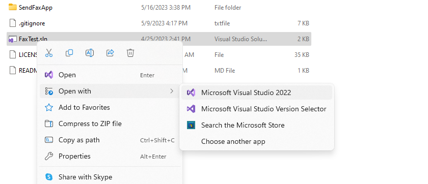
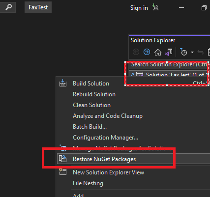
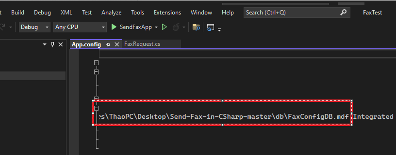
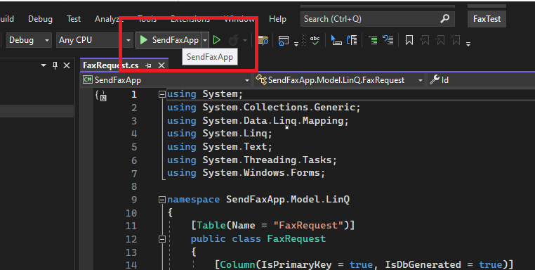
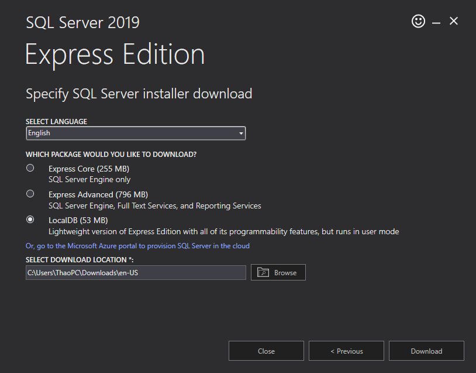
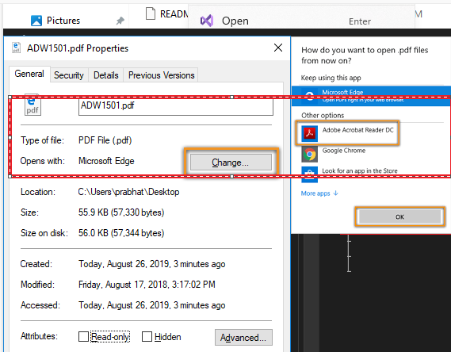

# Send-Fax-in-CSharp
This is all about sending Faxes in c# 


# Tasks to do before using the Code
You need to confirm few configurations, which can be found at https://www.codeproject.com/Articles/1159834/Send-Fax-with-fax-modem-in-Csharp, before you start using the code.


# Development Tools
- Visual studio :https://visualstudio.microsoft.com/fr/vs/community/
- Adobe reader:https://download.com.vn/download/adobe-reader-4829
- MS SQL Local db :https://learn.microsoft.com/en-us/sql/database-engine/configure-windows/sql-server-express-localdb?view=sql-server-ver16
- .NET Frame Wowrk 6.0 :https://dotnet.microsoft.com/en-us/download/dotnet/6.0

After install all development tools : you need to  set up development enviroment

# Set up development enviroment:
Prepare :install visual ,install .net 6.0,install adobe reader
1. Git clone :https://github.com/thanhnb1988/faxscan.git
2. Open project by using visual studio :

3. Restore nuget package in project :

3. Copy 2 file database FaxConfigDB.mdf and FaxConfigDB.ldf from Database folder  to other place then change connection string in AppConfig :

4. Run project :



# Deploy  enviroment:
Prepare :MS SQL Local db,install .net 6.0,install adobe reader
1. Install .net 6.0, install adobe reader
2. Install MS SQL Local
- Downloal sqldb local 2019 and install :https://learn.microsoft.com/en-us/sql/database-engine/configure-windows/sql-server-express-localdb?view=sql-server-ver16


- Create sql local db instance by comand :
```bash
SqlLocalDB delete  MSSQLLocalDB
SqlLocalDB create  MSSQLLocalDB
SqlLocalDB start  MSSQLLocalDB
```
3 .Instal Adobe Reader and make in default open PDF file

3 .Copy 2 file database FaxConfigDB.mdf and FaxConfigDB.ldf from Database folder  to other place then change connection string in SendFaxApp.dll.config

4 .Change connection string 

5. Run project 


